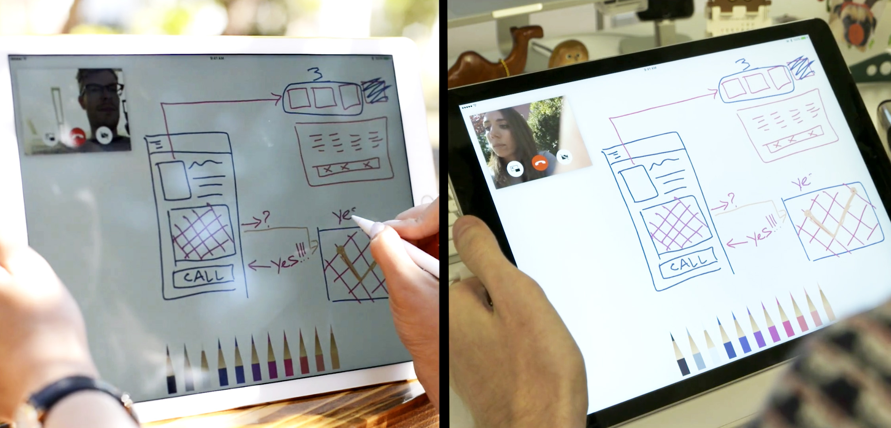

# Realm Draw
> A Collaborative Drawing App, where multiple users can draw to a shared canvas at the same time

The demo application seen in the Realm Mobile Platform [launch video][1], Realm Draw is a real-time collaborative drawing program available for Android, iOS and Xamarin. Any number of users may draw on a single shared canvas at any given moment with the strokes appearing on all devices in real time.

# Features

- [x] Allows multiple users to contribute drawings to a shared canvas in real-time.
- [x] Canvas can be reset by shaking the device briefly.
- [x] Can connect to any running instance of Realm Mobile Platform.

# Requirements

### iOS
- iOS 9.0 and above
- Xcode 8.3

### Android
- Android 4.0.3

### Xamarin
- Android 4.0.3
- iOS 9.3

# Setting Up Realm Mobile Platform

In order to properly use Realm Draw, an instance of the Realm Object Server must be running for which each client copy of the app can connect.

* The [macOS version](https://realm.io/docs/get-started/installation/mac/) can be downloaded and run as a `localhost` on any desktop Mac.
* The [Linux version](https://realm.io/docs/get-started/installation/linux/) can be installed on a publicly accessible server and accessed over the internet.

# Building and Running

Follow the README files in the platform-specific subdirectory of this repository.

* [Android][4]
* [iOS][5]
* [Xamarin][6]

# Connecting to the Realm Mobile Platform
When launching the app each time, you'll be presented with a login form in order to connect to the right Realm Object Server instance.

For the server URL field, you may simply enter `localhost` if you're running out of the iOS Simulator with the Realm Object Server at the same time. For iOS devices running on the same network as that Mac, you can alt-click on the Wi-Fi icon in the macOS status bar to get the Mac's local IP address. You can then manually enter this into the server URL field on the iOS device.

You'll be required to create an admin account the first time you run an instance of the Realm Object Server. You may use this account when logging into Realm Puzzle by entering in the same username/password pair. Alternatively, you may also register new user accounts from the form by tapping the 'Register a new account' button.

# Known Issues

The Android and iOS versions of the app will interoperate; the Xamarin version currently can only share drawings with other copies of itself (compiled for either iOS or Android). This is due to a difference in the way the Xamarin platform handles its drawing canvas compared to the native iOS and Android code bases.

# Contributing

See [CONTRIBUTING.md](CONTRIBUTING.md) for more details!

This project adheres to the [Contributor Covenant Code of Conduct](https://realm.io/conduct/). By participating, you are expected to uphold this code. Please report unacceptable behavior to [info@realm.io](mailto:info@realm.io).

# License

Distributed under the Apache license. See ``LICENSE`` for more information.

[1]: https://realm.io/news/introducing-realm-mobile-platform/
[2]: https://realm.io/docs/get-started/installation/mac/
[3]: https://realm.io/docs/get-started/installation/linux/
[4]: https://github.com/realm-demos/realm-draw/tree/master/Android
[5]: https://github.com/realm-demos/realm-draw/tree/master/Apple
[6]: https://github.com/realm-demos/realm-draw/tree/master/Xamarin
